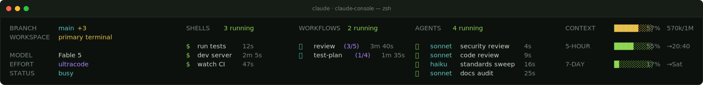

# claude-console

<p align="center">
  
</p>

**A live session HUD for [Claude Code](https://claude.com/claude-code), rendered right inside every terminal tab.** It replaces the one-line statusline with a full dashboard — your model, effort, branch, context and rate-limit gauges, and every agent, workflow, and shell the session is running — refreshed as you work. Each tab shows its own session; run `claude-console` for the same view on demand. Zero runtime dependencies, plain Node ≥ 18.

## Quick start

```bash
# 1 — clone
git clone https://github.com/argishtiovsepyan/claude-console.git
cd claude-console

# 2 — install (backs up your settings first; fully reversible)
./install.sh

# 3 — open a new Claude Code tab. The HUD appears under the input box.
```

That's it. The installer points your Claude Code statusline at `claude-console` and touches nothing else. It renders **only** inside Claude Code sessions — plain terminals are unaffected.

Remove it any time with `claude-console uninstall`, which restores your previous statusline exactly.

## What you're looking at

At full width the HUD is five columns. Each live kind — shells, workflows, agents — only appears when something is actually running, so an idle session stays quiet.

| Column | Shows |
| --- | --- |
| **Rail** | workspace (or worktree), branch + dirty count, model, effort, status, remote, and the working directory |
| **`$` shells** | running shell commands — what each is for and how long it's run |
| **🛸 workflows** | running orchestrations with progress `(done/total)` and age |
| **👾 agents** | running subagents — the model each runs, its task, and age |
| **Gauges** | context-window usage, plus 5-hour and 7-day rate-limit usage with reset times |

Narrower terminals fold gracefully: five columns → three → two → a single stack.

## Commands

```
claude-console                 deep view of the session you're in
claude-console --watch         live-refreshing view (Ctrl-C to exit)
claude-console --all           one line per session on this machine
claude-console --json          machine-readable session data
claude-console --ascii         pure-ASCII output (NO_COLOR is also honored)

claude-console update          reinstall from this checkout after a git pull
claude-console verify          confirm the install is wired and rendering
claude-console doctor          environment + data-source health check
claude-console rollback        restore the most recent settings backup
claude-console uninstall       restore your pre-install statusline
```

The default view picks a session by: `--session <id>` → `$CLAUDE_CODE_SESSION_ID` (set inside Claude's shells) → the session whose directory contains your current one → the most recent live session.

## Configuration

Entirely optional. Create `~/.claude/hud/config.json` to override defaults; the environment variables `NO_COLOR` and `CLAUDE_HUD_ASCII=1` always take precedence.

```jsonc
{
  // extra HUD sections (both off by default)
  "hud": { "sections": { "skills": false, "failures": false } },

  // gauge color thresholds — [warn %, critical %]
  "thresholds": { "usage": [70, 90], "context": [50, 75] },

  // how long a git dirty-count is cached before re-checking (ms)
  "gitDirtyTtlMs": 10000
}
```

Prefer the old compact statusline instead of the full HUD? Set `"statusline": { "mode": "block" }` for the two-row block, or add `"style": { "layout": "line" }` for a single row.

## How it works

Every value comes from a verified source — never scraped from terminal output. Anything unavailable renders as `unknown`, never invented.

| Data | Source |
| --- | --- |
| Model, effort, context %, rate limits, repo, worktree, PR | the JSON Claude Code pipes to the statusline on every render |
| Terminal width | `COLUMNS` / `LINES`, set by Claude Code |
| Agents & workflows | the session's own transcript directories (`subagents/…`, `workflows/…`) |
| Running shells + their purpose | in-flight `Bash` tool calls in the transcript |
| Branch / dirty / worktree | `git` against the session's directory (cached) |
| Live sessions & busy/idle | the `~/.claude/sessions/<pid>.json` registry |

The statusline hot path is built to never block: it exits in well under a second, caches slow lookups, and writes its state atomically. `claude-console doctor` reports live render times from your machine.

## Security

- Central redaction runs over every rendered command, label, and name: known token prefixes (`sk-ant-`, `ghp_`, `xox…`, JWTs, …), `Authorization` / `Cookie` headers, `key=value` secrets, URL passwords, and high-entropy blobs. SHAs, UUIDs, and file paths are preserved.
- Agent prompts are never displayed — only their short descriptions.
- The installer changes only the `statusLine` value in your `~/.claude/settings.json`, backs it up first, and restores it byte-for-byte on uninstall.

## Development

```bash
npm test    # 214 tests · node:test · zero dependencies
```

Plain Node ESM under `src/` — no build step, no packages. MIT licensed.
